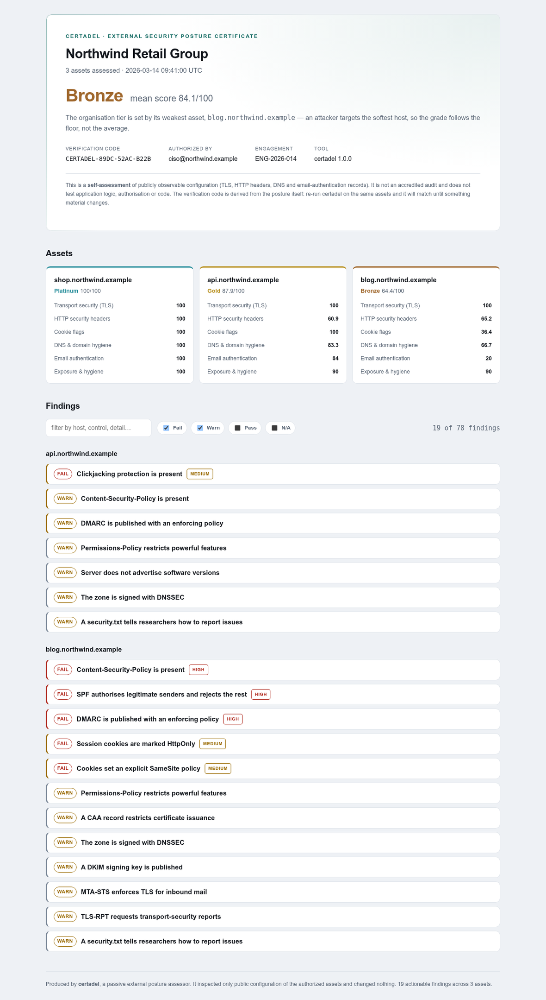
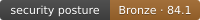
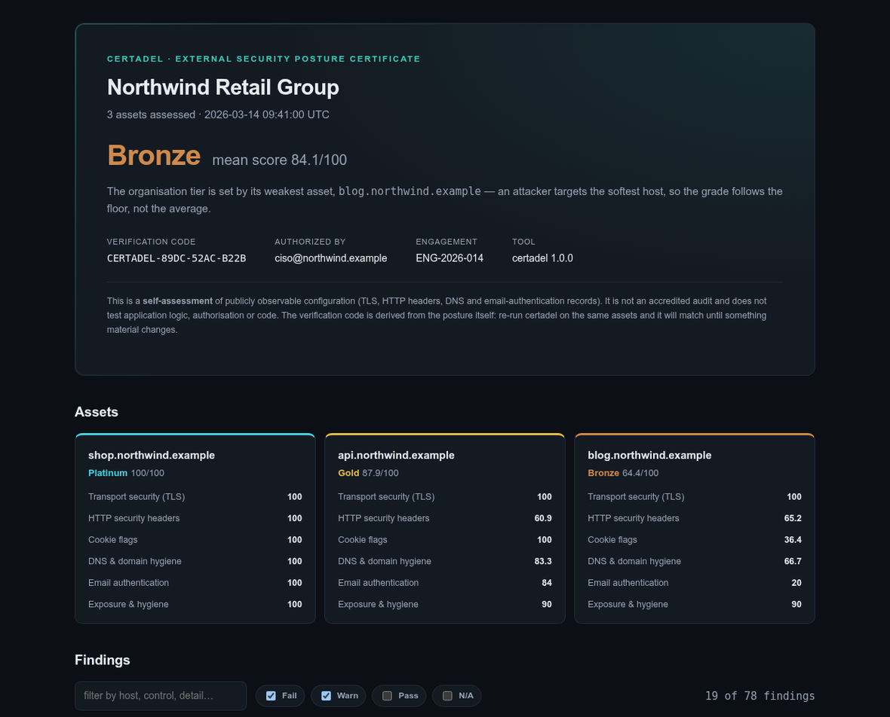

# certadel

**Certify your citadel.** A passive, authorized external security-posture assessor that
grades a company's internet-facing assets against a transparent rubric and issues a
leveled certificate — an HTML report, an SVG badge, and machine-readable JSON.

One command, no install, no dependencies:

```sh
npx certadel assess --scope scope.json --out ./report
```

certadel inspects only the **public configuration** your hosts already show every
visitor — TLS, HTTP security headers, cookies, DNS, and email-authentication records —
scores each host, rolls the assets up into an organisation grade, and writes a
certificate you can share. It never exploits, never authenticates, never writes, and
refuses to touch any host you did not authorize.



---

## Why

The controls certadel checks are the ones that quietly decay: a `Content-Security-Policy`
nobody added, a DMARC record still at `p=none` two years after go-live, TLS 1.0 left
enabled on a forgotten marketing host, a cookie missing `Secure`. Each is public, each is
cheap to check, and each is invisible until someone goes looking across a dozen consoles
and correlates the results by hand.

There are excellent single-purpose tools for pieces of this — SSL Labs for TLS, Mozilla
Observatory for headers, various DMARC checkers. What there isn't is **one command that
grades your whole external posture across every asset and hands you a certificate with a
level you can act on and share.** That's certadel.

- **For a company:** run it on your own domains, get a Bronze→Platinum grade, a
  prioritised list of exactly what to fix, and a badge for your status page.
- **For a consultant:** point it at a client's authorized scope and produce a formal,
  reproducible certificate as a deliverable.
- **For a pipeline:** gate deploys on it — `--min-tier silver` exits non-zero on a
  regression.

## Install

Nothing to install — run it with `npx`:

```sh
npx certadel --help
```

Or install it:

```sh
npm install -g certadel     # global CLI
npm install certadel        # as a library
```

Requires **Node.js 18.17+**. Zero runtime dependencies — the entire tool is Node
built-ins, which for a security tool is the point: there is no third-party supply chain
to trust inside it, and you can read all of it.

## Quick start

```sh
# 1. Create a scope file naming what you are authorized to assess
npx certadel init

# 2. Edit scope.json — your organisation and its hostnames
#    { "organization": "Acme", "assets": ["acme.com", "www.acme.com", "api.acme.com"] }

# 3. Assess and write the certificate, report and badge
npx certadel assess --scope scope.json --out ./report
```

You get a terminal summary immediately, and in `./report/`:

| File | What it is |
|---|---|
| `certadel-certificate.html` | The self-contained certificate + full findings (open in any browser) |
| `certadel-badge.svg` | A badge for your README or status page |
| `certadel-report.json` | Every finding, for a dashboard or ticket queue |

### The scope file is the authorization

```json
{
  "organization": "Acme Ltd",
  "authorizedBy": "security@acme.com",
  "reference": "ENG-2026-014",
  "assets": ["acme.com", "www.acme.com", "api.acme.com"]
}
```

certadel assesses **only** the hosts listed here (and their subdomains, which the email
checks need). There is no wildcard, no `--all`, and no flag to skip the check. Point it
only at assets you are authorized to assess. See
[the methodology](docs/methodology.md) for the exact list of every request it makes.

## The certification

Each host is scored 0–100 across six dimensions and assigned a tier. The organisation's
grade is set by its **weakest** asset — an attacker targets the softest host, so the
grade follows the floor, not the average.

| Tier | Meaning |
|---|---|
| 🟦 **Platinum** | 95+, no high or critical gaps. Exemplary. |
| 🟨 **Gold** | 85+, no critical gaps. Strong. |
| ⬜ **Silver** | 70+, no critical gaps. Solid, with room to improve. |
| 🟫 **Bronze** | 50+, no critical gaps. The basics are there. |
| 🟥 **Not certified** | Below 50, **or** any critical control failing. |

The gates are the honest core: **a high score cannot buy back a critical hole.** An
expired certificate, TLS 1.0 still enabled, or no HTTPS at all means Not Certified no
matter how good everything else is — because a certificate that reads "Gold" with the
front door open is worse than no certificate. The full weighting is in
[docs/rubric.md](docs/rubric.md).

### What each dimension checks

| Dimension | Controls |
|---|---|
| **Transport (TLS)** | HTTPS served, obsolete TLS 1.0/1.1 disabled, certificate valid & not expiring, key strength, forward secrecy, HSTS |
| **HTTP headers** | Content-Security-Policy, X-Content-Type-Options, clickjacking protection, Referrer-Policy, Permissions-Policy, version disclosure |
| **Cookies** | Secure, HttpOnly, SameSite |
| **DNS hygiene** | CAA, nameserver redundancy, DNSSEC |
| **Email authentication** | SPF, DKIM, DMARC policy strength, MTA-STS, TLS-RPT |
| **Exposure** | HTTP→HTTPS redirect, security.txt (RFC 9116), mixed content |

Run `certadel checks` to list every individual control and its points.

## Use it as a CI gate

Block a deploy when posture regresses:

```sh
certadel assess --scope scope.json --min-tier silver
# exits 0 if the organisation is Silver or better, 1 otherwise
```

```yaml
# .github/workflows/posture.yml
- run: npx certadel assess --scope scope.json --min-tier gold
```

And put the grade on your README with the generated badge — the way a build badge or a
coverage badge works:



## Use it as a library

```js
import { certify, renderHtml, renderBadge } from 'certadel';

const report = await certify('scope.json');
console.log(report.rollup.tierLabel, report.rollup.score);

for (const asset of report.assets) {
  const critical = asset.findings.filter((f) => f.severity === 'critical' && f.status === 'fail');
  if (critical.length) console.log(asset.host, 'has critical gaps:', critical.map((f) => f.title));
}

await fs.writeFile('cert.html', renderHtml(report));
await fs.writeFile('badge.svg', renderBadge({ tier: report.rollup.tier, score: report.rollup.score }));
```

## Passive and authorized, by construction

certadel is adjacent to offensive tooling, so it holds itself to a standard you can
verify rather than trust:

- **One way onto the network.** Every HTTP request goes through a single client
  restricted to `GET`/`HEAD`, with a capped body and bounded redirects that never leave
  your authorized scope. It has no method or body parameter — no code path can write.
- **It cannot exceed the scope file.** The scope guard is checked before every
  connection, including before following a redirect off-domain.
- **No exploitation, ever.** No authentication, no port scanning, no enumeration, no
  fuzzing, no payloads. It reads public configuration and nothing else. The complete
  list of every request it makes is in [docs/methodology.md](docs/methodology.md).
- **Enforced by tests.** [`test/safety.test.js`](test/safety.test.js) fails the build if
  a second network path, a write method, a raw socket, or a spawned process is ever
  introduced. These guards were verified by deliberately breaking the tool and confirming
  they go red.

The generated certificate carries a **verification code** derived from the posture
itself (not the timestamp), so anyone handed a certificate can re-run certadel and
confirm it still matches — and it changes precisely when something material changes.

<details>
<summary>Dark mode</summary>


</details>

The screenshots above are rendered by [`examples/generate-sample.js`](examples/generate-sample.js)
from synthetic data through the exact same scoring and rendering a real run uses. The
organisation, hosts, and findings are invented; no real assessment data appears in this
repository.

## Limitations

Knowing what a tool does **not** check is the difference between a security aid and false
comfort. certadel is honest about its edges.

- **It is not a penetration test.** certadel reads public configuration. It does not test
  authentication, authorization, business logic, injection, SSRF, or anything requiring
  interaction beyond an ordinary request. A Platinum grade means your *outer
  configuration* is exemplary, not that your application is free of vulnerabilities.
- **It is not a compliance certification.** A tier here is not SOC 2, ISO 27001, PCI-DSS,
  or any accredited standard. The certificate says so, in those words. It is a
  self-assessment (or a consultant's assessment) of observable posture.
- **Configuration, not enforcement.** certadel sees that MFA-grade controls like DMARC or
  CSP are *published*; it cannot see whether every send path or page actually honours
  them, or whether a WAF silently compensates.
- **DKIM is best-effort.** Selectors are chosen by the sender, so a missing key at the
  common selectors warns rather than fails — absence of proof isn't proof of absence.
- **Point-in-time.** It is a snapshot, not a monitor. Re-run it (that's what the badge and
  CI gate are for).
- **Mail applicability is inferred** from MX and SPF records; a domain that sends mail
  through an unusual setup may be graded differently than intended.

## Development

```sh
npm test           # node --test — zero dependencies, ~40 tests
npm run typecheck  # tsc --checkJs — types via JSDoc, no build step
node examples/generate-sample.js   # regenerate the sample certificate
```

The network layer and the grading layer are kept separate: everything that touches the
wire is in `src/net/`, everything that decides a grade is a pure function over collected
evidence. That is why the whole scoring surface is tested deterministically with no
network, plus one real end-to-end test against a local HTTPS server.

## License

[MIT](LICENSE). Run it only against assets you are authorized to assess.
